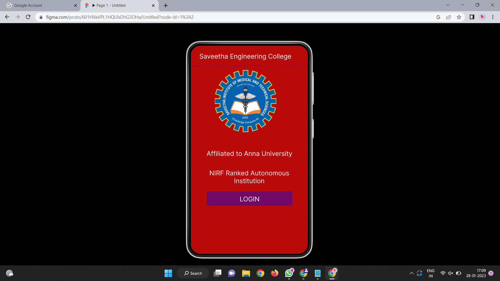
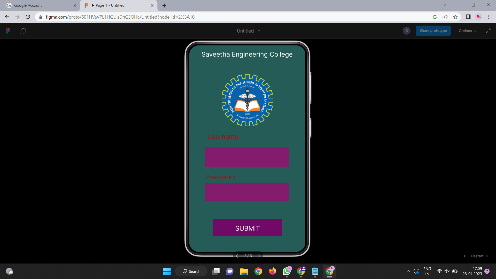
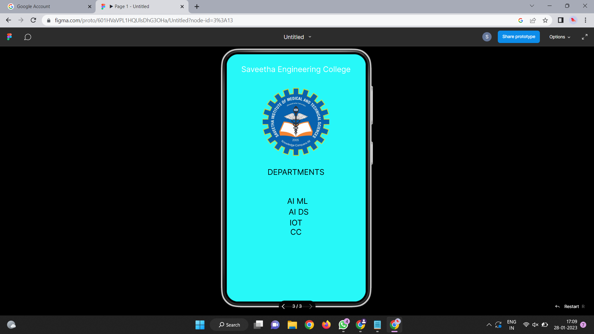

# Event Registration Web Application

## AIM:
To design, develop and deploy a web application for event registration.

## DESIGN STEPS:

### Step 1:
Create a new frame.

### Step 2:
Select any one preset size of your choice.

### Step 3:
Select the shapes you need.

### Step 4:
Import images as needed.

### Step 5:
Create pages based on your need and link them.

### Step 6:

Validate the HTML and CSS code.

### Step 6:

Publish the website in the given URL.

## CODE:
/* Home Page */

position: relative;

width: 360px;

height: 640px;

background: #BA0B0B;

/* Rectangle 2 */

position: absolute;

width: 260px;

height: 61px;

background: #831C6C;

/* saveethalogo 2 */

position: absolute;

width: 189px;

height: 191px;

background: url(saveethalogo.png);

opacity: 0.2;

/* Saveetha Engineering College */

position: absolute;

width: 609px;

height: 129px;

font-family: 'Inter';

font-style: normal;

font-weight: 400;

font-size: 20px;

line-height: 24px;

text-align: center;

color: #FFFFFF;

/* Login Page */

position: relative;

width: 360px;

height: 640px;

background: #255C58;

/* Vector 1 */

position: absolute;

width: 355px;

height: 0px;

border: 1px solid #710707;

/* SEC Page */

position: relative;

width: 360px;

height: 640px;

background: #27F8F8;

/* Vector 3 */

position: absolute;

width: 354px;

height: 0px;

border: 1px solid #000000;

## DESIGN TOOL:
Figma

## OUTPUT:

## RESULT:
The program to design, develop and deploy a web application for event registration is completed successfully.
